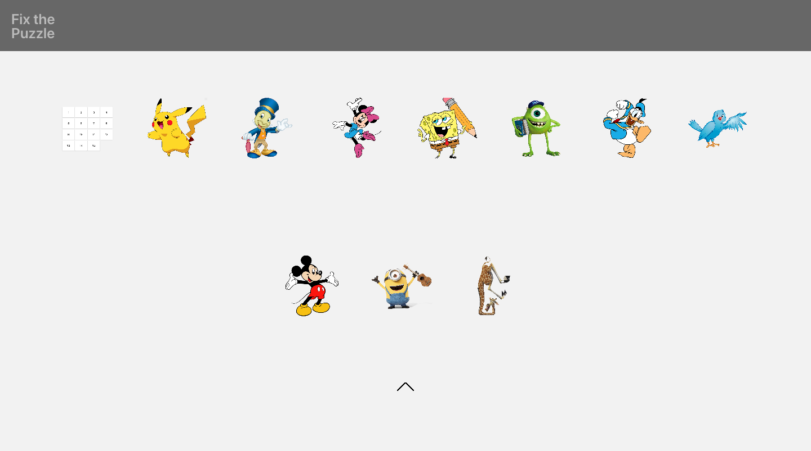
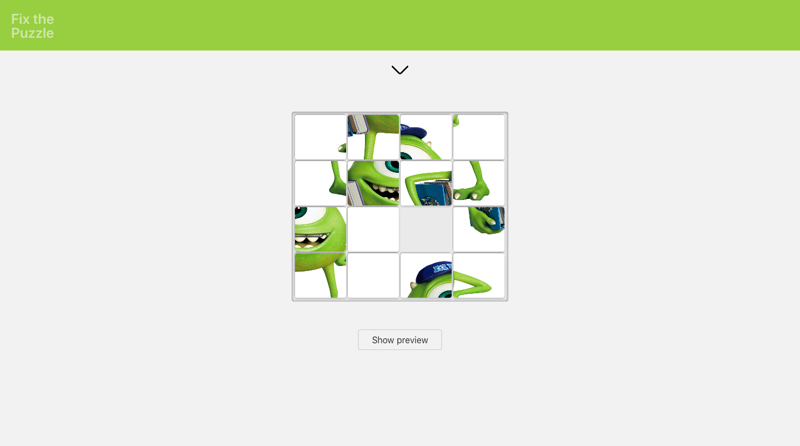

# React Puzzle Game

Fix a series of scrambled pictures, but be careful - it is quite addicting.

The game will save your progress in local storage. To reset your game status and start over you need to click on the logo.

## Setup

This is a React project. Make sure you have node installed.

To install all dependecies run `npm install`.

## Run locally

To run the project locally run `npm start`.

You can then open the project on [http://localhost:3000/](http://localhost:3000/) in the browser.

## Build the project

To build the project: `npm run build`

Builds the app for production to the `build` folder.
